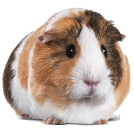

# NamadeGames

### Тестовое задание на стажировку
#### Направление: Программист Unreal Engine

###### Время на выполнение - 2 недели. Выполнить можно как на С++ так и на Blueprints. Нельзя использовать никакие сторонние плагины и библиотеки, только голый проект ThirdPerson и встроенный функционал движка. Для отправки решения можно сжать и отправить в виде zip файла либо залить проект на гитхаб (гитхаб предпочтительнее). 

  
Основное задание:

   
  
  1. Установить Unreal Engine 5.0.3 (Для решения на С++ так же потребуется VS2022)
  2. Создать проект на основе шаблона Third Person
  3. Добавить персонажу функционал ускоренного бега(спринт) на кнопку Shift (анимация не обязательна)
  4. Пока игрок держит кнопку Shift персонаж должен бежать с удвоенной скоростью, если игрок отпустил кнопку Shift то персонаж должен вернуть скорость по умолчанию.
  5. Добавить персонажу функционал приседа (crouch) на кнопку Ctrl, принцип активации и деактивации идентичный спринту.
  6. Скорость во время передвижения вприсяд должна быть в 2 раза ниже обычной
  7. На экран вывести скорость персонажа.

  
Бонусные задачи:

   
  
  * Будет плюсом если настроите анимации Crouch. Сами анимации можно взять с Mixamo или с Unreal Marketplace.
    ###### Либо использовать эти https://drive.google.com/drive/folders/1OY2JFCIdNT_24WDLN8osMWUSX6LdLM9J?usp=sharing
  * Будет так же плюсом если для Sprint сделаете Camera Shake и изменяемый Field Of View (FOV).

#### Перед отправкой убедитесь что всё работает и что не упустили никакие файлы.
* В случае если вы забудете загрузить анимации будем считать что этот пункт не выполнен.
* В случае если вы что-то выполнили, но оно не работает то это будет считаться не выполненным.
* В случае если у вас работает, а у нас нет то это так же будет считаться не выполненным. 

